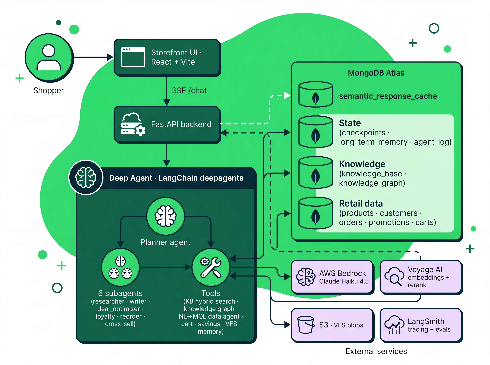

# MongoDB × LangChain Deep Agents — Agent Cartsmith Retail Shopping Assistant (Quickstart)

A standalone reference application: a **grocery / recipe / savings concierge** built on
[LangChain `deepagents`](https://github.com/langchain-ai/deepagents) with
**MongoDB Atlas** as the backbone for every stateful surface, and a storefront UI.


## What it shows

A planner agent dispatches to six subagents (via the deepagents `task` tool;
each has its own explicit tool list, not inherited) to answer retail
queries — *"make pasta for 4 and save a shopping list"*, *"what are the
coupon-stacking rules?"*, *"plan a week of dinners on $150"*:

- `researcher` — deep-dives a sub-question via KB + web, ingests findings back into the KB.
- `writer` — composes long-form artifacts (reports/briefs/lists) from the `/workspace` research bundle (filesystem tools only).
- `deal_optimizer` — maximizes cart savings by stacking coupons, penny-exact via `savings_calculator`.
- `loyalty_concierge` — personalized loyalty briefing (tier perks, points at 100 pts = $1, spend-to-next-tier, YTD savings).
- `reorder_concierge` — builds a reorder basket from order-history cadence.
- `basket_cross_sell` — suggests complementary items via co-purchase affinity + recipe completion.

These surfaces back the experience:

| Capability | MongoDB surface |
|---|---|
| Short-term state (resumable chat) | `MongoDBSaver` → `checkpoints` |
| Cross-thread memory (dietary prefs, household) | `MongoDBStore` → `long_term_memory` |
| Agent activity log + episodic recall | `AgentLogMiddleware` → `agent_log` (hybrid search) |
| Vector + lexical knowledge base (policies, recipes) | Atlas Vector Search + `$search` RRF → `knowledge_base` |
| Knowledge graph (product → brand → recipe) | `MongoDBGraphStore` → `knowledge_graph` |
| NL → MQL over live retail data | safety-wrapped `MongoDBDatabaseToolkit` (`products` / `customers` / `orders` / `promotions`) |
| Coupon terms read by `savings_calculator` (`deal_optimizer`) | `promotions` (in the NL→MQL read allow-list) |
| Semantic response cache (query-keyed, per-turn) | `ResponseCache` ($vectorSearch over the user query) → `semantic_response_cache` (on by default) |
| Shopping cart (written only by cart tools) | `carts` (excluded from NL→MQL) |
| HITL checkout (`place_order`, approve / edit / reject) | resumable `interrupt()` under `MongoDBSaver` (opt-in via `HITL_TOOLS`) |
| VFS metadata (saved shopping lists) | `vfs_files` (blobs in S3) |

LLM: AWS Bedrock Claude Haiku 4.5. Embeddings: Voyage AI (`voyage-4` /
`voyage-4-lite` + `rerank-2.5`). Tracing: LangSmith SaaS (env-only).

## Architecture

<p align="center">
  
</p>

A turn flows **UI → FastAPI (SSE) → planner**. The planner answers directly with
its tools or dispatches a subagent via the deepagents `task` tool; every
stateful surface — conversation state, memory, knowledge, retail data, and the
response cache — lives in MongoDB Atlas, with S3 for VFS blobs and Bedrock /
Voyage / LangSmith as external services.

## Quickstart

First, configure your environment:

```bash
cp .env.example .env          # set MONGODB_URI, VOYAGE_API_KEY, AWS creds, S3, LangSmith
```

Key `.env` values:

```bash
MONGODB_DB=agent_cartsmith_retail_demo                       # fresh DB — seeding is idempotent
DATA_AGENT_ALLOW_LIST=products,customers,orders,promotions   # fail-closed; carts is excluded (never NL→MQL)
VFS_BACKEND=s3  +  VFS_S3_BUCKET / VFS_S3_PREFIX
LANGSMITH_TRACING=true  LANGSMITH_API_KEY=lsv2_...  LANGSMITH_PROJECT=agent-cartsmith-retail-demo
```

### Option A — one-command Docker deploy (recommended)

The fastest way to a running stack. [`scripts/deploy.sh`](scripts/deploy.sh)
builds the images, boots the backend + storefront, provisions Atlas indexes,
seeds the retail data, and health-checks the result — all from `.env`:

```bash
scripts/deploy.sh
```

When it finishes it prints the URLs (backend on `:8010`, storefront on `:3000`
by default). Tear down with `scripts/deploy.sh --down`. See
[docs/DEPLOY.md](docs/DEPLOY.md) for prerequisites, overrides, and deploying to
other container platforms.

### Option B — local development (uv)

Run the pieces directly for an iterative dev loop:

```bash
# 1. install (pulls the published agent-log package from GitHub)
uv sync --extra dev

# 2. provision Atlas indexes once (admin DDL — not run on every boot)
PROVISION_INDEXES_ON_BOOT=true uv run python -c \
  "from deep_agent.persistence.indexes import ensure_indexes; ensure_indexes()"

# 3. seed retail data (products/customers/orders + KB + KG)
uv run deep-agent seed

# 4. run it
uv run deep-agent chat --once "Find pasta ingredients for 4 and their prices" --user demo
uv run deep-agent serve --port 8000          # FastAPI SSE backend
cd frontend && npm install && npm run dev     # storefront UI (proxies /api -> :8000)
```

## Walkthrough

A suggested path through the application's capabilities:

1. **Architecture** — the planner agent plus six subagents (researcher, writer,
   deal_optimizer, loyalty_concierge, reorder_concierge, basket_cross_sell);
   tools (KB vector/hybrid, knowledge graph, NL→MQL data agent, cart, VFS
   write, memory); Atlas as the data layer, S3 for VFS blobs.
2. **Pasta query** — preset #1. The chat panel shows the agent call
   `knowledge_base_hybrid_search` (recipe) → `mongodb_query` on `products`
   (price/stock) → `write_file` (shopping list). The file appears in **Files
   Saved**.
3. **Cart → savings → checkout** — add items to the cart (`carts`), dispatch
   `deal_optimizer` to stack coupons from `promotions` (penny-exact
   `savings_calculator`), then `place_order` raises the HITL interrupt — the
   Approve / Edit / Reject card resumes under `MongoDBSaver` (requires
   `HITL_TOOLS=place_order`).
4. **Promotion query** — preset #2 (coupon-stacking); KB retrieval plus the
   researcher subagent.
5. **MongoDB Compass** — inspect `checkpoints`, `vfs_files`, `knowledge_base`,
   `carts`, and the decoded `agent_log` documents live.
6. **LangSmith** — nested traces, a 👍/👎 rating landing as `user_score` on the
   trace, and the eval suite (substring + LLM-judge + tool-trajectory) with a
   model A/B comparison. See [docs/langsmith-showcase.md](docs/langsmith-showcase.md).

## Evals (LangSmith)

```bash
uv run python scripts/create_evals_dataset.py   # uploads agent-cartsmith-retail-demo by default
uv run deep-agent-evals --dataset agent-cartsmith-retail-demo            # substring + LLM-judge + tool-trajectory
uv run deep-agent-evals --dataset agent-cartsmith-retail-demo --model global.anthropic.claude-sonnet-4-6   # A/B
```

See [docs/langsmith-showcase.md](docs/langsmith-showcase.md) for the full
tracing → feedback → experiment-comparison walkthrough, and
[docs/evals.md](docs/evals.md) for the evaluator details.

## Tests

```bash
uv run pytest                                  # 405 tests (integration tier skipped by default)
uv run ruff check src tests && uv run mypy --strict src
cd frontend && npm run build                   # tsc + vite
```

See [`docs/`](docs/) for architecture, configuration, and deployment, and
[`docs/verification.md`](docs/verification.md) for the end-to-end verification
runbook.
